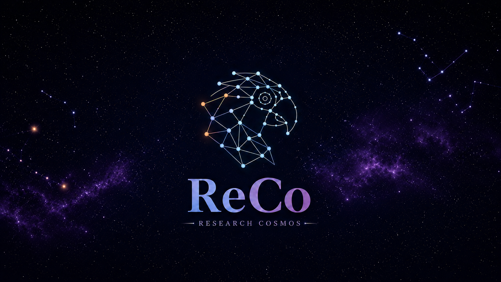

  

# Research Cosmos (ReCo)

**A self-configuring and self-extending agentic platform for biomedical research.**

ReCo, short for **Research Cosmos**, is a desktop agentic research platform designed to help researchers configure, run, document, and extend complex computational workflows. It combines a large-language-model reasoning engine, a graphical desktop interface, project memory, native file/system tools, structured skills, and Model Context Protocol (MCP) servers for biomedical and life-sciences research.

ReCo ships with a curated toolkit for common research tasks, but its central purpose is broader: when a user provides a GitHub repository, local codebase, or framework documentation, ReCo can study the source, infer its dependencies and capabilities, generate a dedicated MCP server, verify the new interface, document it, and add it to the ReCo ecosystem under user supervision.

## Why ReCo?

Modern biomedical research moves quickly. New AI models, analysis pipelines, segmentation tools, omics workflows, and imaging frameworks are released constantly, but using them often requires manual installation, dependency conflict resolution, custom wrapper code, and detailed knowledge of each framework's interface.

ReCo was developed to reduce this barrier. It provides:

- A **desktop research environment** for interacting with agentic workflows through natural language.
- A bundled set of **ready-to-use MCP servers** for medical imaging, tabular modelling, radiomics, segmentation, model evaluation, and exploratory analysis.
- A **self-configuration workflow** for first-time setup of Python environments and bundled tools.
- A **self-extension workflow** that allows ReCo to ingest additional frameworks from repositories or local codebases.
- **Project memory and chat traces** so research context, tool calls, and outputs can be reviewed across sessions.
- A built-in **medical image viewer** for anatomical images and segmentation masks.
- Support for hosted and local reasoning backends, including Anthropic, DeepSeek, Ollama Cloud, and local Ollama.

ReCo is intended for researchers, medical physicists, biomedical engineers, clinicians, and students who need to use advanced computational tools without repeatedly rebuilding the same infrastructure around each new framework.

## Core Capabilities

### Bundled Research Toolkit

ReCo includes pre-installed MCP servers derived from previous research frameworks: [mAIstro](https://github.com/eltzanis/mAIstro) and [ReclAIm](https://github.com/eltzanis/ReclAIm). The bundled toolkit includes capabilities for:

- Exploratory data analysis and statistical summaries.
- Feature-importance analysis and feature selection.
- Radiomic feature extraction.
- Tabular classification and regression.
- Two-dimensional and three-dimensional medical image classification.
- Model-performance comparison and performance-decline monitoring.
- Medical image segmentation through TotalSegmentator.
- nnU-Net workflow support for segmentation model training and deployment.

These bundled servers are useful immediately after setup, but they also serve as reference implementations that guide how ReCo generates new MCP servers.

### Self-Configuration

On first launch, ReCo can configure itself by:

1. Detecting whether Conda is available.
2. Installing Miniconda when required.
3. Creating isolated Conda environments grouped by dependency compatibility.
4. Installing and verifying the Python dependencies required by the bundled MCP servers.
5. Registering the interpreter paths used by those servers.

Bundled servers remain disabled until the user enables the required capability from the Servers panel.

### Self-Extension

ReCo can add new capabilities from a Git repository or local source folder. The user starts the process from the Chat panel by asking ReCo to add a new framework.

The agent then follows the MCP-installation workflow:

1. Obtain the source under user confirmation.
2. Inspect dependency files, documentation, source structure, and entry points.
3. Infer the required Python version and runtime pattern.
4. Study bundled MCP servers as implementation examples.
5. Propose an MCP tool surface for user approval.
6. Create a dedicated Conda environment.
7. Generate the MCP server implementation, manifest, helper files, and documentation.
8. Verify the generated server through MCP initialization and tool-list checks when technically possible.
9. Register the new server in ReCo, disabled by default until the user enables it.

### Project Memory and Session Traces

ReCo organizes work into projects. Each project can maintain persistent memory, allowing paths, decisions, framework details, and research context to carry across chats.

Stored chat sessions also act as behavioral traces. They record user prompts, agent responses, tool invocations, tool inputs, and tool outputs, which allows prior workflows and agent decisions to be inspected after completion.

### Imaging Infrastructure and Workflow Orchestration

ReCo is not limited to wrapping model code. In validation work, ReCo configured Orthanc as a PACS-like DICOM server, generated an MCP client for Orthanc communication, retrieved imaging examinations, ran downstream AI/computational workflows, and uploaded generated DICOM artifacts back to the server.

This demonstrates how ReCo can act as an integration layer between research frameworks and imaging infrastructure, supporting workflows that combine tools such as foundation models, segmentation frameworks, and radiation dosimetry pipelines.

## Application Interface

The ReCo desktop application includes the following panels:

- **Chat**: natural-language interaction with the ReCo agent, streamed responses, tool calls, tool outputs, and permission prompts.
- **Servers**: enable/disable bundled and user-installed MCP servers, configure interpreters, inspect model-cache usage, open documentation, and install new servers.
- **Skills**: inspect and enable structured agent skills.
- **Projects**: create research workspaces and edit project memory.
- **Previous Chats**: reopen, rename, export, delete, and review stored chat traces.
- **Viewer**: inspect CT/MR volumes and segmentation masks, control overlays, edit masks, and save corrected outputs.
- **Settings**: configure the reasoning backend, model selection, native tools, and permission policy.
- **About / Documentation**: access application information and bundled documentation.

## User Guide

A detailed step-by-step user guide is available here:

**[ReCo User Guide](docs/user-guide.md)**

The guide covers model configuration, skills, first-launch setup, enabling MCP servers, project memory, previous chats, the medical image viewer, and the self-extension workflow for adding new frameworks.

## Example Self-Extension Workflow

A typical workflow for adding a new framework is:

1. Create a new ReCo project for the framework and make that project active.
2. Open a new chat and provide the GitHub repository, paper, or local codebase path.
3. Ask ReCo to add the framework to its capabilities.
4. Review the installation plan and approve or reject the proposed actions.
5. Review the proposed MCP tool surface.
6. Allow ReCo to create the environment and MCP server.
7. Inspect the generated documentation.
8. Enable the new server from the Servers panel.
9. Start a new chat and use the new framework through natural language.

## Validation Examples

ReCo has been evaluated on heterogeneous framework-ingestion cases, including:

- **[Merlin](https://github.com/StanfordMIMI/Merlin)**: CT foundation-model capabilities including CT image embedding, CT-text scoring/retrieval, phenotype classification, disease-risk prediction, and report generation.
- **[MAISI-v2](https://github.com/NVIDIA-Medtech/NV-Generate-CTMR/tree/main)**: CT and brain MR image synthesis workflows, including paired mask-image generation and mask-conditioned CT generation.
- **[asari](https://github.com/shuzhao-li-lab/asari)**: command-line LC-MS metabolomics processing and artifact-level recomputation.
- **[DosimeTron](https://arxiv.org/abs/2604.06280)**: re-hosting of a local multi-server PET/CT Monte Carlo dosimetry framework.
- **[Orthanc](https://www.orthanc-server.com/)**: DICOM server setup and PACS-like workflow orchestration with downstream AI tools.

These examples are used to evaluate ReCo's self-extension behavior.

## Release Note

We intend to release ReCo as an open-source research platform. Before public release, we aim to perform a broader external evaluation of its capabilities across different research teams, domains, institutions, and real-world research scenarios.

We welcome expressions of interest from academic research teams in the biomedical domain, including medicine, radiology, medical physics, biology, biomedical engineering, and related fields. Participating teams will help evaluate ReCo's ability to configure, ingest, document, and operationalize research frameworks relevant to their own scientific workflows.

If you would like to participate in the ReCo evaluation, please express your interest by contacting:

Dr. Eleftherios Tzanis

Email: tzaniseleftherios@gmail.com

---
## Disclaimer

**Important safety & data-handling notice**

ReCo is an autonomous agent that can read and write files, run code, and call external
model APIs on your behalf. Please read the following before using it.

- **Research use only — not for clinical use.** ReCo is intended for research purposes.
  It is **not** certified as a medical device and must **not** be used for clinical
  diagnosis, treatment planning, or patient management.
- **Unsupervised actions can be destructive.** If ReCo is not run in a safe, isolated
  environment, and if you do **not** review and approve each action (set the permission
  policy to *ask for approval* rather than allow-all), the agent may access sensitive
  data, read or modify patient data, and **delete files and folders** on this machine.
- **Risk of patient-data leakage via the API.** Unless the core reasoning engine is a
  **local LLM**, reading DICOM metadata or CSV/Excel files that contain patient-sensitive
  information sends that content to a third-party model provider through the API call —
  which may expose protected health information outside your control. Use a local model,
  and/or fully de-identified data, when handling sensitive records.
- **No warranty.** The developers make no guarantees regarding the accuracy or
  suitability of any models or analyses produced with this software. Use is entirely at
  your own risk. The software is provided "as is", without warranty of any kind, express
  or implied.

You are responsible for complying with the data-protection, privacy, and ethics
obligations that apply to your data and jurisdiction.

---

## Citation

If you use ReCo in your research, please cite:

> Tzanis E, Klontzas ME. **ReCo: a self-configuring and self-extending agentic framework for biomedical research.** *medRxiv*. 2026;2026.07.14.26358025. doi:[https://doi.org/10.64898/2026.07.14.26358025](https://doi.org/10.64898/2026.07.14.26358025)

ReCo includes the capabilities of previously published open-source frameworks. If your work makes use of these capabilities through ReCo, please also consider citing:

- **ReclAIm:** https://doi.org/10.1148/ryai.250923
- **mAIstro:** https://doi.org/10.1016/j.ejrai.2025.100044

## License

To be added.

## Contact

**Dr. Eleftherios Tzanis**  
Email: tzaniseleftherios@gmail.com
