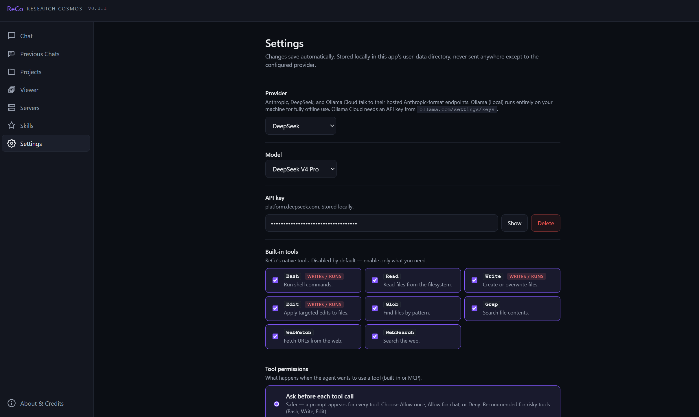
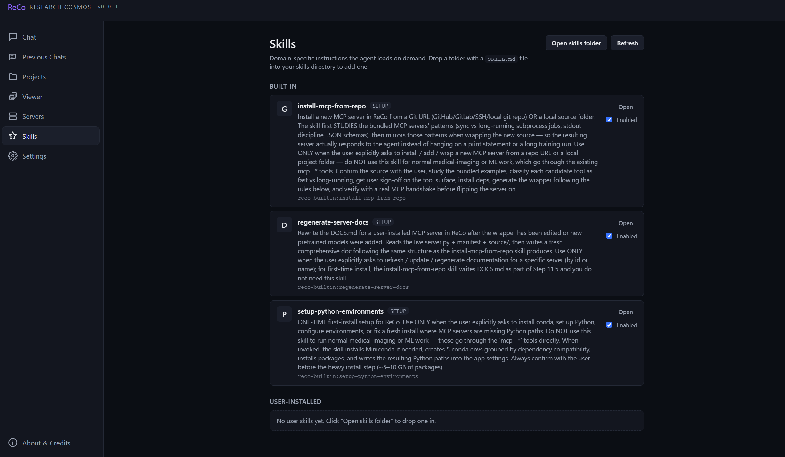
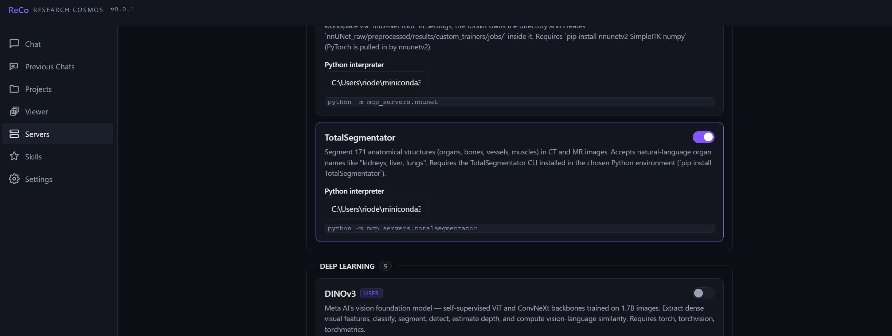
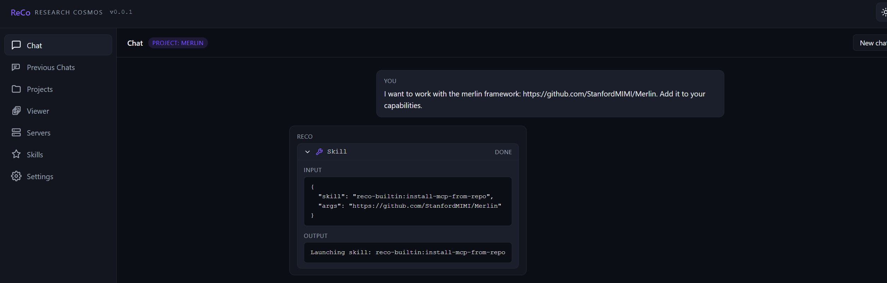
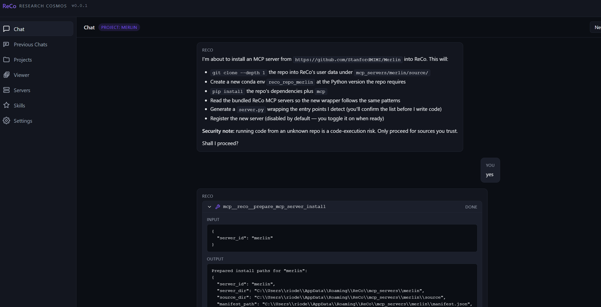
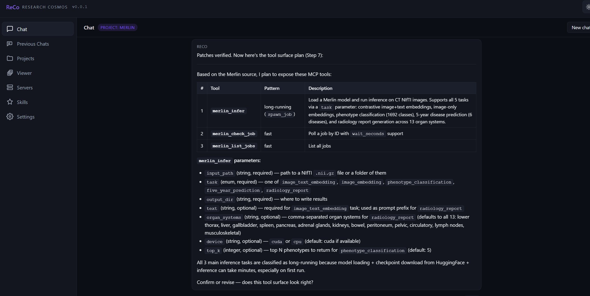
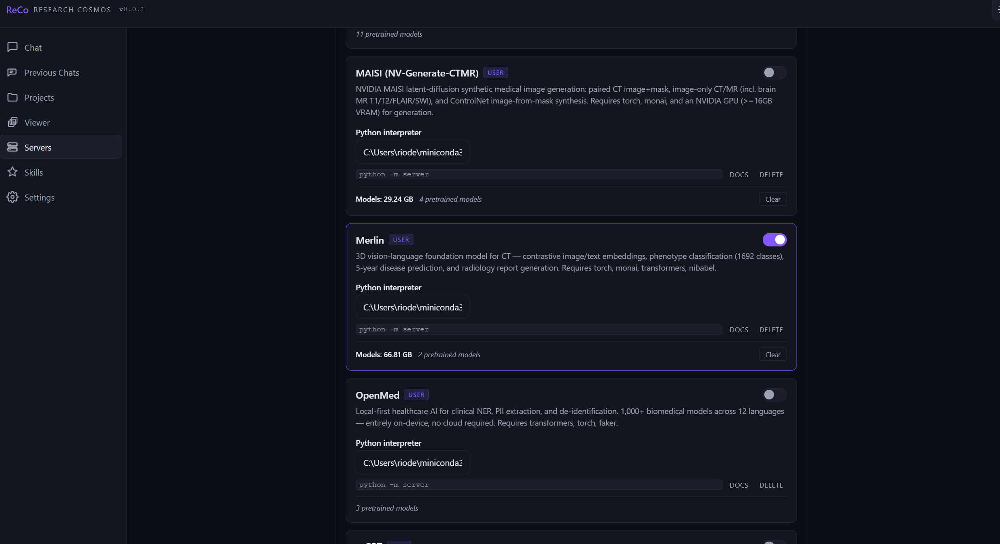
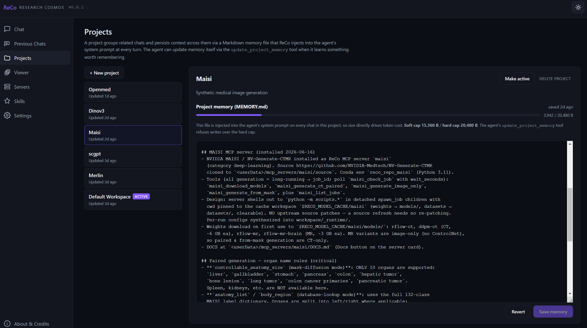
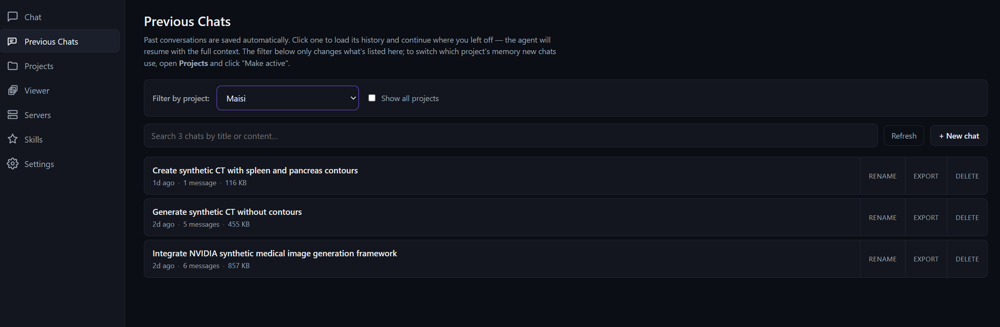
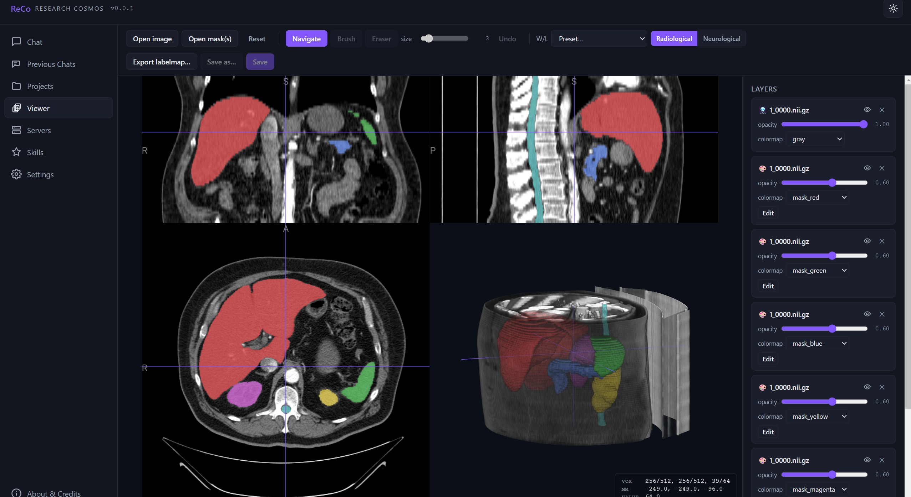

# ReCo — Research Cosmos

### User Guide · v0.0.1

---

This guide walks through the first-run setup and the main panels of the app, step by step.

---

## Step 1 — Choose and configure your model

Everything in ReCo is driven by a language model (LLM). Before anything else, open the
**Settings** panel and tell ReCo which model to use.

**Provider and model.** Pick a **Provider** from the dropdown, then a **Model**. ReCo
supports:

- **Anthropic (Claude)** — Anthropic's hosted Claude models. Create an API key at
  https://console.anthropic.com/settings/keys
- **DeepSeek** — DeepSeek's hosted models. Create an API key at
  https://platform.deepseek.com/api_keys
- **Ollama Cloud** — hosted open models. Create an API key at
  https://ollama.com/settings/keys
- **Ollama (Local)** — open models running entirely on your own machine, for fully
  offline use and maximum data privacy. No API key needed; install Ollama from
  https://ollama.com/download

**Authentication.** Most providers authenticate with an **API key** — create one at the
provider's link above, then paste it into the **API key** field. The key is encrypted and
stored locally on your machine.

> **Tip — data privacy:** If you work with patient-sensitive data, be aware that with a
> hosted provider, any file content the agent reads (DICOM metadata, CSV/Excel records) is
> sent through the API to that provider. It is strongly advised to work with **anonymized
> data**, or to use **local LLMs (Ollama Local)** if your equipment allows it.

**Enable the built-in tools.** Scroll to **Built-in tools**. These are ReCo's native
capabilities — reading and writing files, running shell commands, searching, and web
access. They are **disabled by default**; enable the ones the agent needs so it can
actually act on your machine. For a typical research workflow, enabling all of them
(Bash, Read, Write, Edit, Glob, Grep, WebFetch, WebSearch) gives the agent its full
range of abilities.

**Set tool permissions.** Under **Tool permissions**, choose what happens when the agent
wants to use a tool. We recommend **"Ask before each tool call"** — a prompt appears for
every action, and you can **Allow once**, **Allow for chat**, or **Deny**. This keeps you
in control, which is especially important for tools that write files or run commands.

---

## Step 2 — Skills

**Skills** are domain-specific instruction sets that the agent loads on demand to perform
specialized, multi-step procedures correctly. Open the **Skills** panel to see them.

ReCo includes three built-in skills, all **enabled** by default:

- **install-mcp-from-repo** — installs a brand-new MCP server into ReCo from a Git URL or
  a local source folder. This is the mechanism that lets you extend ReCo with **any**
  framework: the skill studies how the bundled servers are built and mirrors those
  patterns when wrapping your new source.
- **regenerate-server-docs** — rewrites the documentation for a user-installed server
  after its tools change.
- **setup-python-environments** — the one-time first-install routine that sets up Python,
  the conda environments, and the bundled servers (used in Step 3).

You are not limited to the built-in skills. To **import your own skill**, click
**Open skills folder** and drop in a folder containing a `SKILL.md` file, then click
**Refresh**. Your custom skill appears under **User-installed** and becomes available to
the agent.

---

## Step 3 — Set up the system and run your first task

Once your LLM is selected and configured, you do a **one-time system setup** so that the
pre-included MCP servers become usable.

### 3a. First-launch setup

Go to the **Chat** panel and start a new chat with a simple prompt such as:

> *"This is the first launch of the app. Please set it up."*

The agent will then, with your confirmation at the heavy step:

1. **Check for Conda** and install Miniconda if it isn't already present.
2. **Create 5 Conda environments**, grouped by dependency compatibility, and install all
   the required packages into them (this is a large download, roughly 5–10 GB).
3. **Configure all the MCP servers** so that ReCo's **10 pre-included tools** are wired up
   and ready to run.

This step runs once. When it finishes, the bundled servers are installed and configured —
but, by design, **not yet exposed to the agent**.

### 3b. Enable the server you need

To expose a tool to the agent, open the **Servers** panel and toggle on the server you
want to use. The 10 bundled servers are:

| Server | What it does |
| --- | --- |
| **TotalSegmentator** | Segment 171 anatomical structures (organs, bones, vessels, muscles) in CT/MR. |
| **nnU-Net Segmentation Toolkit** | End-to-end nnU-Net v2: prepare data, preprocess, train, and predict segmentations. |
| **PyRadiomics Feature Extraction** | Extract radiomic features (first-order, shape, GLCM, GLRLM, GLSZM, GLDM, NGTDM). |
| **Medical Image Classification (2D)** | PyTorch 2D classification — ResNet, VGG, Inception, EfficientNetV2, fine-tuning. |
| **Medical Image Classification (3D)** | PyTorch + MONAI 3D classification — 3D ResNet/DenseNet and fine-tuning. |
| **Classification Model Performance Comparison** | Compare training vs. inference metrics to detect performance degradation. |
| **PyCaret Classification** | Tabular classification AutoML — compare, tune, blend, evaluate, infer. |
| **PyCaret Regression** | Tabular regression AutoML — compare, tune, blend, evaluate, infer. |
| **Feature Importance & Selection** | Tabular feature importance/selection (Random Forest, F-test, mutual info, RFE). |
| **EDA Analysis** | Exploratory data analysis with publication-quality plots and statistical tests. |

### 3c. Run a task

After enabling a server, open a **new chat** and make your request. For example, to
segment anatomy in a CT scan:

1. Enable the **TotalSegmentator** server (as above).
2. Start a new chat and provide the **path to the CT scan** — either by typing it, or by
   using the dedicated **file input button** to browse and select it.
3. Ask the agent in plain language, e.g. *"Segment the liver, spleen, and kidneys in this
   CT and save the masks."*

The agent sees the exposed TotalSegmentator tool, calls it with the right parameters, and
fulfils your task — returning the segmented masks. The same pattern applies to every
server: enable it, point the agent at your data, and describe the goal.

---

## The heart of ReCo — self-configuring & self-evolving

This is the single most important capability of ReCo, and the reason it is more than a
collection of pre-built tools: **ReCo can extend itself on demand.** When you point it at
a framework it doesn't yet have, the agent reads that framework's source, learns how it
works, builds a new MCP server that wraps it, and registers it inside the app — turning an
arbitrary external project into a first-class ReCo tool. The 10 bundled servers were
created the same way; you can keep growing the app indefinitely.

The whole process is driven by the built-in **`install-mcp-from-repo`** skill (see
*Step 2 — Skills*), and you supervise it at every important decision.

### Recommended workflow

For clean, well-organized results, follow this order:

1. **Create a project** for the new framework and **name it accordingly** (e.g. *"Merlin"*).
   See *The Projects panel* below.
2. **Activate** that project (**Make active**).
3. **Open a new chat** and **request the add-on** of the new framework.
4. Let the agent **install and configure** the new server (described step by step below).
5. When it finishes, ask the agent to **update the project's memory**, so it has a durable
   record of what it built for future reference.
6. **Enable the new server** in the **Servers** panel.
7. **Open a new chat** (with the same project still active, so the chat is filed under it)
   and **start working** with your new capability.

### What happens during installation

**1. You request the framework.** In a chat, point ReCo at a Git URL (or a local folder)
and ask it to add the framework to its capabilities. The agent recognizes the request and
launches the `install-mcp-from-repo` skill.

**2. The agent presents an install plan and asks permission.** Before touching your
machine, ReCo explains exactly what it intends to do — clone the repo into ReCo's
user-data area, create a dedicated Conda environment, install the framework's
dependencies, study the bundled servers to follow the same patterns, generate a server
wrapper, and register the new server (disabled by default). It also shows a **security
note** — installing from a repository runs code from that source, so only proceed with
sources you trust. Nothing happens until you confirm.

**3. The agent designs the tool surface and confirms it with you.** After studying the
source, ReCo proposes the concrete set of tools the new server will expose — their names,
whether each is *fast* or *long-running* (background job), and their parameters — and asks
you to confirm or revise. This is where you shape how the framework appears inside ReCo.

**4. The new server appears in the Servers panel.** Once installation completes, the new
server shows up in **Servers**, tagged **USER**, alongside the bundled ones. Each card
shows its Python interpreter, the size of any pretrained models, a **Docs** button, and a
**Delete** button. **Toggle it on** to expose it to the agent.

Then open a new chat (with your project active) and begin working with the new tools.

> **Note — first run downloads models.** Frameworks that rely on **pretrained models** —
> such as **Merlin**, **MAISI**, **TotalSegmentator**, and many others — download and
> cache those model weights on their **first run**. That first invocation can therefore
> take a while (the weights may be several GB). Subsequent runs reuse the cached models
> and are much faster.

---

## The Projects panel

A **project** groups related chats and keeps context across them. We strongly recommend
working inside a project.

- **Create a project:** click **+ New project** and give it a name.
- **Make it active:** select the project and click **Make active**. From then on, every
  new chat is saved under that project.
- **Project memory:** each project has a Markdown **memory file** that ReCo injects into
  the agent's system prompt on every chat in the project. This is how work carried out in
  one chat stays "in context" for later chats. You can ask the agent to **update the
  project's memory** so that what's been done is remembered, and you can also **edit the
  memory manually** in this panel and click **Save memory**.

Keeping a project active and its memory current is the key to long-running research that
spans many sessions.

---

## The Previous Chats panel

Past conversations are saved automatically. The **Previous Chats** panel lets you return
to them.

- **Filter by project** to see only that project's chats (or tick *Show all projects*).
- **Open** a chat to load its full history and continue where you left off — the agent
  resumes with the complete context.
- For each chat you can **Rename** it, **Export** it (to save or share the conversation),
  or **Delete** it.

---

## The Viewer

If you work with medical-imaging data, ReCo includes an integrated **Viewer** for CT/MR
volumes and their organ/tissue contours (segmentation masks).

You can use the Viewer in two ways:

- **Manually:** click **Open image** to load a scan and **Open mask(s)** to overlay
  contours. Adjust per-layer opacity and colormaps, scroll through the axial / coronal /
  sagittal planes, inspect the 3D rendering, and use the brush/eraser tools to **curate**
  masks. You can then **Save** or **Export** the edited labelmap.
- **Driven by the agent:** after the agent produces a segmentation, you can simply ask it
  to *open the CT and the contours in the viewer* for inspection — a natural workflow for
  reviewing and curating results the agent generated for you.

---

## Disclaimer

**Important safety & data-handling notice**

ReCo is an autonomous agent that can read and write files, run code, and call external
model APIs on your behalf. Please read the following before using it.

- **Research use only — not for clinical use.** ReCo is intended for research purposes.
  It is **not** certified as a medical device and must **not** be used for clinical
  diagnosis, treatment planning, or patient management.
- **Unsupervised actions can be destructive.** If ReCo is not run in a safe, isolated
  environment, and if you do **not** review and approve each action (set the permission
  policy to *ask for approval* rather than allow-all), the agent may access sensitive
  data, read or modify patient data, and **delete files and folders** on this machine.
- **Risk of patient-data leakage via the API.** Unless the core reasoning engine is a
  **local LLM**, reading DICOM metadata or CSV/Excel files that contain patient-sensitive
  information sends that content to a third-party model provider through the API call —
  which may expose protected health information outside your control. Use a local model,
  and/or fully de-identified data, when handling sensitive records.
- **No warranty.** The developers make no guarantees regarding the accuracy or
  suitability of any models or analyses produced with this software. Use is entirely at
  your own risk. The software is provided "as is", without warranty of any kind, express
  or implied.

You are responsible for complying with the data-protection, privacy, and ethics
obligations that apply to your data and jurisdiction.

---

## Contact

**Developer:** Dr. Eleftherios Tzanis
**Email:** tzaniseleftherios@gmail.com

---

## How to cite ReCo

ReCo's pre-configured tools are rooted in the following two papers. If ReCo contributes
to your research, please cite:

- https://doi.org/10.1148/ryai.250923
- https://doi.org/10.1016/j.ejrai.2025.100044

